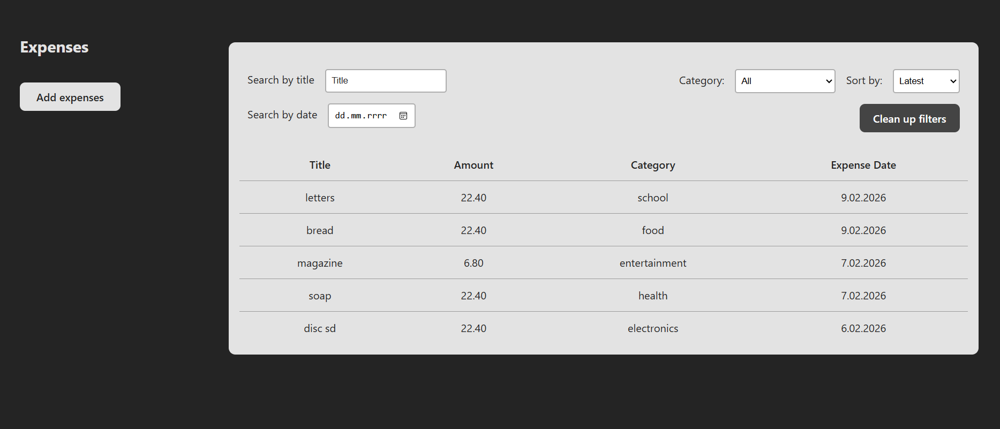
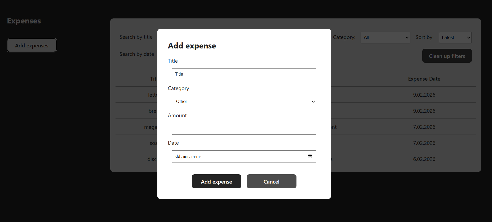

# Expense Tracker

Simple full-stack expense tracking app





## Tech stack

- FRONTEND: React + Vite + TypeScript
- BACKEND: FastAPI (Python)
- Database: MySQL

## Features

- List all expenses
- Add daily expenses IN PROGRESS
- Filter by category
- Search by title
- Search by exact date
- Sort by latest/oldest/highest/lowest/A-Z/Z-A
- Reset active filters
- ...

# How to run locally

```bash
cd backend
python -m venv venv
source venv/Scripts/activate
pip install -r requirements.txt
uvicorn main:app --port 8000

cd frontend/expense-app
npm run dev
```
